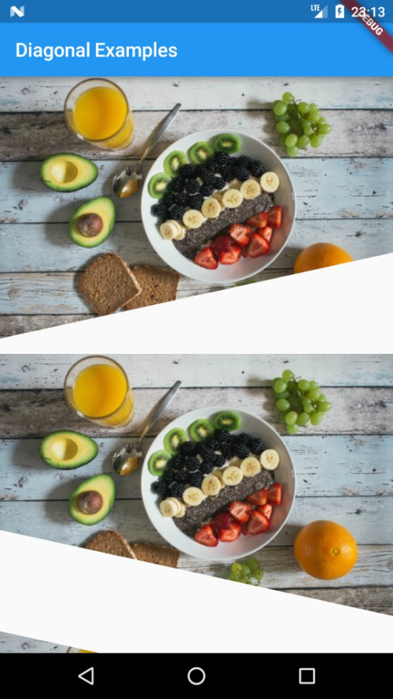

# diagonal

Apply diagonal clipping to your widgets easily.


## Example




```dart
import 'package:diagonal/diagonal.dart';
import 'package:flutter/material.dart';

class DiagonalExamples extends StatelessWidget {
  @override
  Widget build(BuildContext context) {
    return Scaffold(
      appBar: AppBar(
        title: Text('Diagonal Examples'),
      ),
      body: _getBody(),
    );
  }

  _getBody() {
    return ListView(
      children: <Widget>[
        Diagonal(
          child: Image.asset('assets/images/backdrop.jpg'),
          clipHeight: 90.0,
        ),
        Diagonal(
          child: Image.asset('assets/images/backdrop.jpg'),
          position: Position.BOTTOM_RIGHT,
          clipHeight: 90.0,
        ),
        Diagonal(
          child: Image.asset('assets/images/backdrop.jpg'),
          position: Position.TOP_LEFT,
          clipHeight: 90.0,
        ),
        Diagonal(
          child: Image.asset('assets/images/backdrop.jpg'),
          position: Position.TOP_RIGHT,
          clipHeight: 90.0,
        ),
      ]
          .map((item) => Padding(
                padding: EdgeInsets.only(bottom: 16.0),
                child: item,
              ))
          .toList(),
    );
  }
}
```


## Credits

Photo by Jannis Brandt on Unsplash